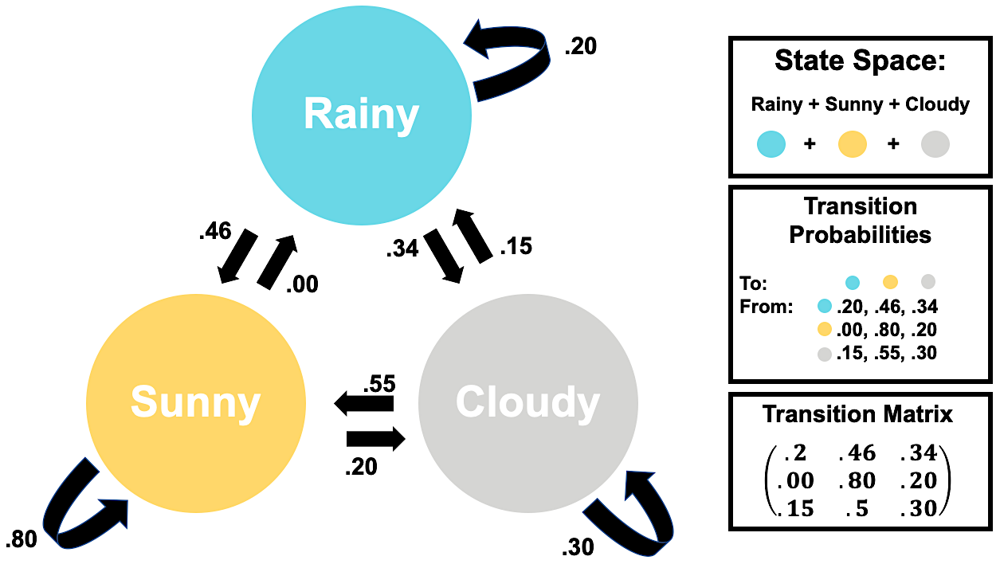

# Mathematical Intuition

Markov Chains are cool! Hidden Markov Models are also cool, but require more preparation! In this section, we'll go through conditional probabilities & set up the basis to study Hidden Markov Models by getting comfortable with chains first.

\

---

## Conditional Probability & Bayes Rule

### Basic Concepts {-}

Probability, as a field, formalizes how we predict events with some equally beautiful & ugly notation, intuitive concepts, and complex mathematical principles. But the premise is simple: by ascribing a numeric value to the outcomes of an event happening, we can abstract the real-world and study it with math. 

The process of ascribing numeric values to the outcome of an event is called a mapping & by mapping all possible probabilities of an event's outcomes we create a **random variable**.

> **NOTE:** This can be confusing! The "random" part of the word doesn't mean all outcomes have an equal chance of happening, really it means that within an event there are multiple possible outcomes.

\

**Example: Weather & Temperature**

Let's say that the weather is the event, $W$, whose only **outcomes** are sunny ($w_s$), rainy ($w_r$) or cloudy($w_c$). 
By mapping numeric values (e.g. probabilities) to the outcomes we can turn $W$ into a random variable. Below, we list all mappings in the **probability mass function**, $p_{(W)}(w)$.

$$\begin{aligned} 
p_{(W)}(w)  &= \begin{cases}
    0.5, & \text{for } w_s \\
    0.2, & \text{for } w_r \\
    0.3, & \text{for } w_c \\
    0.0, & \text{otherwise}
\end{cases}
\end{aligned}$$

\

> **NOTE:** The sub-probability of *all* probability mass functions must sum to 1.

\

Now, let's that the daily temperature (F°) is the event $T$. Normally, we could say that $T$ follows a normal distribution with $\mu = 75 \textbf{ F°}$ and $\sigma^2 = 625 \textbf{ F°}$, since its a continuous variable. So, $T \sim N(75, 625)$ and would look something like this

```{r, warning=FALSE, error=FALSE, message=FALSE, echo = FALSE, fig.width=6, fig.height=3, fig.align = "center"}
library(tidyverse)
ggplot(data = data.frame(x = c(-25, 175)), aes(x)) +
  stat_function(fun = dnorm, 
                n = 1000,
                args = list(mean = 75, sd = 25), 
                color="black", size=1.5) + 
  labs(y="Probabilities", title="Temperature (F°)", x="")+
  scale_x_continuous(breaks = seq(0,150, by=25))+
  theme_linedraw()+
    theme(legend.position = "none", plot.title = element_text(hjust=.5))
```

\

Instead, let's say that $T$ is a discrete random variable whose only potential outcomes are cold ($t_c$), fresh ($t_n$), or hot ($t_h$). Then, $T$ has the probability mass function

$$\begin{aligned} 
p_{(T)}(t)  &= \begin{cases}
    0.155, & \text{for } t_c \\
    0.5, & \text{for } t_f \\
    0.345, & \text{for } t_h \\
    0.0, & \text{otherwise}
\end{cases}
\end{aligned}$$

\

Below are two graphs summarizing what we know so far about $W$ and $T$ 

```{r, warning=FALSE, error=FALSE, message=FALSE, echo = FALSE}
data <- data.frame(probability = c(0.5, 0.3,0.2), temperature = c("Sunny", "Rainy", "Cloudy"))

p1<-ggplot(data, aes(x=temperature, y=probability, fill=temperature)) +
  geom_col()+
  scale_fill_manual(values=c("#D5D5D3", "#85D4E3",  "#FAD77B"))+
  labs(y="Probabilities", title="Weather", x="")+
  theme_linedraw()+
    theme(legend.position = "none", plot.title = element_text(hjust=.5))
```

```{r, warning=FALSE, error=FALSE, message=FALSE, echo = FALSE}
data <- data.frame(probability = c(0.155, .5,.345), temperature = c("Cold", "Fresh", "Hot"))

p2 <- ggplot(data, aes(x=temperature, y=probability, fill=temperature)) +
  geom_col()+
  scale_fill_manual(values=c("#3B9AB2", "#00A08A",  "#F1BB7B"))+
  labs(y="", title="Temperature", x="")+
  theme_linedraw()+
    theme(legend.position = "none", plot.title = element_text(hjust=.5))
```

```{r, warning=FALSE, error=FALSE, message=FALSE, echo = FALSE,  fig.width=6, fig.height=4/1.2, fig.align = "center"}
library(gridExtra)
grid.arrange(p1,p2, ncol=2)
```

But what happens if the weather depends on the temperature? 

\
\

### Conditional Probabilities {-}

Let's study the two arbitrary events $A$, $B$ & learn some definitions about probability.

**Conditional Probability:** 
The conditional probabilities of $A$'s, given $B$ and $B$, given $A$ are written below.
$$P(A \mid B) \hspace{1 in}P(B \mid A)$$
\

**Independence:** 
We say that the two events, $A$ & $B$ are independent if the conditional probabilities provide us no new-information about either event. So, 

$$P(A \mid B) = P(A) \hspace{1 in}P(B \mid A) = P(B)$$
\

**Joint Probability:** 
The probability of two events, $A$ & $B$ happening at the same time is called a **joint probability** and is typically denoted by $P(A\cap B)$. It is calculated below.

$$\begin{aligned} 
P(A\cap B) &= P(A \mid B) \cdot P(B)\\
&= P(A) \cdot P(B) && \text{if independent}
\end{aligned}$$

\
\


It's generally true that the weather on a particular day, depends on the temperature. This implies that $W$ and $T$ are conditional events with conditional probabilities. So, 

$$P(W\mid T) \neq P(W)$$

### Bayes' Rule & LOTP {-}

Conceived by Reverend Thomas Bayes in the 18th Century, posthumously published by his friend Richard Price, and then formalized into an equation by Pierre-Simon Laplace, Bayes' Rule is a cornerstone equation in modern statistics & probability^[https://www.bayesrulesbook.com/chapter-1.html#a-quick-history-lesson]. I've written Bayes Rule below^[https://www.bayesrulesbook.com/chapter-2.html]

$$P(A \mid B) = \frac{P(A \cap B)}{P(B)}=\frac{P(A)\cdot P(B \mid A)}{P(B)}$$

> **NOTE**: Above you'll notice that we're looking at the probability of $A$ & $B$, divided by the probability of $B$. We are dividing by $P(B)$ to normalize & isolate the probability of $A$, under the conditions we observe $B$.

> **Quick Check:** If $A$ & $B$ are independent, how would you further simplify the numerator of Bayes' Rule?

The denominator of Bayes' Rule, $P(B)$ is called the **marginal probability** of $B$.

The marginal probability can either be

- given 
- computed with the **law of total probability** or (**LOTP**). 

**LOTP** states that
$$\begin{aligned}
P(B) = \sum_{i=1}^n P(B \cap A_i) &= P(B \cap A_1) + P(B\cap A_2) + \dots + P(B\cap A_n) \\
&= P(B \mid A_1)P(A_1) + P(B\mid A_2)P(A_2) + \dots + P(B\mid A_n)P(A_n) \\
\end{aligned}$$

> **Note:** Looks scary! Really it's like calculating the probability of $B$ in each subcategory of $A$, multiplying by the probability of that sub-$A$, then adding it all together.

\

---

## Markov Chains

**Stochastic processes** are events which have some element of randomness in their outcomes. The amount of 'randomness' & the type of events can vary depending on the context. In turn, studying the properties of stochastic processes often requires many different techniques which go well beyond the boundaries of statistics. And with a litany of applications across so many domains of knowledge, studying stochastic processes also involves many techniques from Physics, Linguistics, Sociology, Public Health, Geography & more. 

> **Note:** There is *some* nuance in the language we use to describe randomness, probabilistic, and stochastic, but it is murky. So, for now, let's stick with the above definition & enjoy some interchangeability between random, stochastic, and probabilistic.

So, this section will only be a tiny snippet of the wide topics covered in studying stochastic processes.

### Intuition {-}

Markov chains are a subclass of stochastic processes which describe partially-random events occurring in succession, typically in succession. We will formalize this definition soon, but for now let's talk about the weather.

**Example: Weather**

Let's ignore the fact that temperature determines weather. Instead, let's assume that we can compute the probability of tomorrow's weather by only looking at today's. This results in three important ideas:

- General weather patterns before today are irrelevant when predicting the tomorrow's weather. This is an example of a Markov process, more specifically a Markov Chain.
- The outcomes of the weather are rainy, sunny, or cloudy. These are examples of states.
- The probability of tomorrow's weather depends on whether it was rainy, sunny, or cloudy to day. Meaning there are probabilities associated with tomorrow's events, strictly defined by today's. These are examples of transition probabilities.

Let's be rigorous now!

### Mathematical Definitions {-}

Let $X_i = X_1, \dots, X_{n-1}, X_n$ be a collection of $n$ successively indexed events.

The discrete $X_i$ are a **Markov Chain** if 


- They exhibit a **Markov Property**.
  + Where the probability of some new or predicted event $X_{n+1}=x_{n+1}$ is 

$$P(X_{n+1} = x_{n+1} \mid X_1 = x_1, \dots,  X_{n-1}= x_{n-1}, X_n= x_{n}) = P(X_{n+1} = x_{n+1} \mid X_n = x_n)$$

> **NOTE:** This is similar to the conditional probability of independent events! But instead we specify that prior events $X_1,\dots X_{n-1}$ are independent of the outcome of $X_{n+1}$, but $X_{n}$ is not.

\

- There is some countable set of outcomes called the **State Space** which contains every possible outcome or **State** 
  + The outcomes $x_1, \dots, x_{n-1}, x_{n}, x_{n+1}$ are all common elements of the state space, $\mathbb{S}$.

> **NOTE:** This may seem complicated, but this means we can define what are possible and impossible outcomes.

\


- The probability of changing states is a **Transition Probability** and if we were to write them out for each *state*, they would sum to $1$.
  + Transition Probabilities sum to 1 because they cumulatively define the *probability mass function* of the transition from each state to another.
  + These probabilities can be placed in a **Transition Matrix** where the columns indicate a next state & the rows indicate the current state.  
  
> **NOTE:** The above definitions were cumulatively drawn from the following sources ^[Lay, David C. 2012. “Applications to Markov Chains.” In Linear Algebra and Its Applications, 4th ed., 253–62. Boston: Pearson College Division.] ^[https://setosa.io/ev/markov-chains/]
  
\
  
### Visualizations {-}  
  
**Weather Graphs**

Below we've redefined our weather example as a Markov Chain, using our new definitions, and place it into a Weighted Directed Graph. Isn't she pretty! Note that the *weights* on our arrows correspond to the transition probability associated with that change-arrow. 



Also, check out that Transition Matrix! It's the first one you've looked at, but they can get very and very complex, quickly.

\

**Weather Animations**

To simulate how a Markov Chain of weather behaves, let's animate it! 

In this visualization, there are 10 multicolored dots representing different arbitrary days colored by that particular day's weather. To see how Markov Chains evolve over 15 days, we shuffle them 15 times in a row  according to our transition matrix 

|Rainy|Sunny|Cloudy|
|:---:|:---:|:----:|
| .20 | .46 | .34 |
| .00 | .80 | .20 |
| .15 | .50 | .30 |

Written text describes the proportion of weather outcomes following simulation. That is, how many rainy, sunny, or cloudy days happen after a given shuffle.

```{r, warning=FALSE, error=FALSE, message=FALSE, echo = FALSE, fig.align = "center"}
library(plotly)
set.seed(200322)
markov2 <- function(n = 10, iter = 15, start_probs = c(.4, .4, .2), 
                    trans_probs = matrix(c(.2, 0, .15, 
                                           .46, .8, .55,
                                           .34, .2, .30), ncol = 3),
                    plot_prob = TRUE) { # Here we have a full non-zero transition matrix.
  #Check to see if probability entries are valid.
  if(sum(start_probs) != 1 | any(start_probs < 0)) 
    stop("start_probs must be non-negative and sum to 1.")
  if(any(apply(trans_probs, 1, sum) != 1))
    stop("trans_probs matrix rows must sum to 1.")
  if(any(trans_probs < 0))
    stop("elements of trans_probs must be non-negative")

  dt <- matrix(NA, nrow = iter, ncol = n) # Initialize matrix to hold iterations
  # Run chain
  for(i in 1:iter) {
    for(j in 1:n) {
      if(i == 1) { # if we're at the beginning of the simulation
        dt[i, j] <- sample(x = c(0, 1, 2), size = 1, prob = start_probs)
      } else {
        if(dt[i - 1, j] == 0) { # if the previous state was 0
          dt[i, j] <- sample(x = c(0, 1, 2), size = 1, prob = trans_probs[,1])
        } else if (dt[i - 1, j] == 1) { # if the previous state was 1
          dt[i, j] <- sample(x = c(0, 1, 2), size = 1, prob = trans_probs[,2])
        } else {
          dt[i, j] <- sample(x = c(0, 1, 2), size = 1, prob = trans_probs[,3])
        }
      }
    }
  }
  
  # Return chain as dataframe
  return(as.data.frame(dt))
}

df2 <- markov2()


df_long2 <- df2 %>%
  rowid_to_column(var = "iter") %>%
  pivot_longer(cols = V1:V10) %>%
  group_by(name) %>%
  mutate(x = value + rnorm(1, 0, .10) + rnorm(n(), 0, .01),
         y = value %% 2 + rnorm(1, 0, .10) + rnorm(n(), 0, .01),
         initial = value[1],
         is_0 = ifelse(value == 0, TRUE, FALSE),
         is_1 = ifelse(value == 1, TRUE, FALSE)) %>%
  group_by(iter) %>%
  mutate(prop0 = mean(is_0),
         prop1 = mean(is_1),
         prop2 = 1 - prop0 - prop1) %>%
  ungroup()

anim2 <- df_long2 %>%
  plot_ly(
    x = ~x,
    y = ~y,
    color = ~factor(initial),
    size = 5,
    colors =c("#D5D5D3", "#85D4E3",  "#FAD77B" ),
    frame = ~iter,
    type = 'scatter',
    mode = 'markers',
    showlegend = FALSE
  )
anim2 <- anim2 %>%
  add_text(x = 0, y = .35, text = ~prop0, textfont = list(color = "#D5D5D3", size = 24, opacity = .6)) %>%
  add_text(x = 1, y = 1.25, text = ~prop1, textfont = list(color = "#85D4E3", size = 24, opacity = .6)) %>%
  add_text(x = 2, y = .35, text = ~prop2, textfont = list(color = "#FAD77B", size = 24, opacity = .6))

ax2 <- list(
  zeroline = TRUE,
  showline = TRUE,
  mirror = "ticks",
  showticklabels = FALSE,
  gridcolor = toRGB("white"),
  gridwidth = 2,
  zerolinecolor = toRGB("white"),
  zerolinewidth = 4,
  linecolor = toRGB("black"),
  linewidth = 2,
  title = ""
)

anim2 <- anim2 %>%
  layout(xaxis = ax2, yaxis = ax2) %>%
  animation_opts(redraw = FALSE) %>%
  animation_slider(hide = TRUE) %>%
  animation_button(x = .6, y = .10, showactive = FALSE, label = "Run Simulation") %>%
  config(displayModeBar = FALSE, scrollZoom = FALSE, showTips = FALSE)
  
anim2


```
Look at that! We converged on our initial probability distribution. That isn't necessarily true for all simulations, but it's true for this one.

> **NOTE:** This Markov Chain visualization was designed by [Will Hipson](https://willhipson.netlify.app), a graduate student in Psychology at Carleton University. You can find links for reproduction at his page^[https://willhipson.netlify.app/post/markov-sim/markov_chain/] or check out my GitHub to see my edits.
 

\

---

## Conclusion

We've covered the necessary probability concepts. In the next section, we'll find out out how we can leverage Markov Chains to predict another set of variables, even when we can't see the outcomes of our chain. Prepare for bivariate distributions, many subscripts, and a lot of summation notation!

If you have any lingering questions, I've linked some great YouTube videos that may be helpful below.


## Video Resources {-}

**Conditional Probability**

<center>
<iframe width="560" height="315" src="https://www.youtube.com/embed/ibINrxJLvlM" frameborder="0" allow="accelerometer; autoplay; clipboard-write; encrypted-media; gyroscope; picture-in-picture" allowfullscreen></iframe>
</center>


**Bayes Rule**

<center>
<iframe width="560" height="315" src="https://www.youtube.com/embed/XQoLVl31ZfQ" frameborder="0" allow="accelerometer; autoplay; clipboard-write; encrypted-media; gyroscope; picture-in-picture" allowfullscreen></iframe>
</center>

**Markov Chains**

<center>
<iframe width="280" height="157.5" src="https://www.youtube.com/embed/VCyJGp6Enxg" frameborder="0" allow="accelerometer; autoplay; clipboard-write; encrypted-media; gyroscope; picture-in-picture" allowfullscreen></iframe>  

<iframe width="280" height="157.5" src="https://www.youtube.com/embed/JHwyHIz6a8A" frameborder="0" allow="accelerometer; autoplay; clipboard-write; encrypted-media; gyroscope; picture-in-picture" allowfullscreen></iframe>  

</center>


## References {-}

