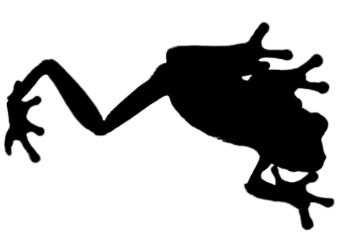
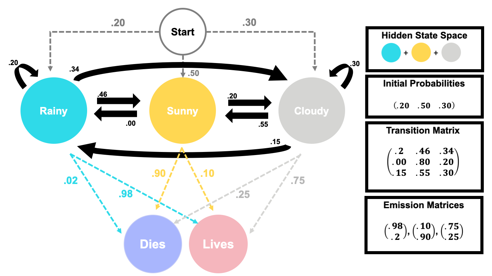

# Frog Families & HMMs

Previously, we wanted to study the weather. Let's up the stakes and now look at how the weather can determine whether or not a cute, infinitely reproducing, frog-family survives the month.

If you were a frog, you wouldn't be able to check the weather before leaving your tree hide-- you wouldn't even be able to read!-- but you do know that when a family member leaves for their daily hop, their chance of living depends on the weather. If the weather is 

- **Sunny:**      they would have a 10% chance of living (and eating a nice bug) with a 90% chance of dying.
- **Cloudy:**     they would have a 75% chance of living (and eating a nice bug) with a 25% chance of dying.
- **Rainy:**      they would have a 98% chance of living (and eating a nice bug) with a 2% chance of dying.

Since we, as non-frog statisticians, know that the weather is a Markov Chain, we can say the survival of this frog-family is actually a Hidden Markov Model. In the following sections, we will establish what that implies theoretically for us & our frog family.

\

---

## Hidden Markov Models 

Hidden Markov Models are another class of probabilistic models which model Markov processes whose outcomes cannot be directly observed, but their dependent observed events can be. Often, we're really interested in these unobserved events and predicting them, so we can work backwards and use the observed ones^[https://www.nature.com/articles/nbt1004-1315#citeas].

Intuitively, it's like using the shadow of an animal, to guess what it is!

<center>
{#id .class width=50% height=50%}
</center>

\


### Properties {-}

**Let**

- $X_i = X_1=x_1, \dots, X_{n-1}=x_{n-1}, X_n =x_n$ be a collection of $n$ successively indexed events.
- $Y_i =  Y_1=y_1, \dots, Y_{n-1}=y_{n-1}, Y_n =y_n$ be a collection of $n$ successively indexed observations.
- $\lambda = (X,Y)$. 

$\lambda$ is a discrete **Hidden Markov Model** if it fulfills the following definitions:

##### Discreteness: {-}

Both $X_i$ and $Y_i$ are sequential, discrete, random variables with the $n$ observations $x_{1,\dots, n}$ and $y_{1,\dots, n}$.
 
> **Note:** Neither $X_i$ or $Y_i$ *must* be discrete events, but this project is explicitly dedicated to discrete Hidden Markov Models, so we will assume they are. 
 
##### Markov Assumptions: {-}

- The $X_i$ *must* be a Markov Chain. 
   + So, $$P(X_{n} = x_{n} \mid X_1 = x_1, \dots,  X_{n-1}= x_{n-1}, X_n= x_{n}) = P(X_{n} = x_{n} \mid X_n = x_n)$$

- The $Y_i$ exhibit a Markov property where the  $Y_k^{th}$ observation can be solely predicted using the $k^{th}$ state of the $X_i$, for some arbitrary $k$. 
   + So, $Y_i$ observations are solely dependent on the state of the hidden $X_i$ and nothing else. Implying that
   
   $$P(Y_{n} \mid Y_1 = y_1, ..., Y_{n} = y_n, \hspace{.1 in} X_1 = x_1, \dots, X_n= x_{n}) = P(Y_{n}\mid X_{n} = x_{n})$$

 
##### Hidden States: {-}

- **Hidden States:** The unobservable possible outcomes of $X_i$. Denoted as $x_1, \dots, x_{n-1}, x_{n}$.
- Together, the outcomes form the **Hidden State Space**, which we will denote as $\mathbb{S}$.

##### Transition, Emission, and Initial Probabilities: {-}

- **Transition Probability:** The probability of changing $X_i$-states. These are typically placed into a transition matrix.
  + We typically denote this transition matrix as $\mathbb{a}_{ij}$, where we change from state $i$ to state $j$.


- **Emission Probability:** The probability of $Y_i$, given the $X_i$'s state.
  + So, $P(Y_{n}\mid X_{n} = x_{n})$ is the **Emission Probability** which can be placed into the **Emission Matrix**
    + We typically denote these emission probabilities as $b_n$, where $n$ is the state of the $X_i$.
  
- **Initial Probability:** An estimation of $X_i$'s state at some arbitrary point $a$. This is often denoted by $\pi$ and is typically as a start guess.

> **NOTE:** The above definitions were cumulatively drawn from the following sources ^[https://medium.com/@kangeugine/hidden-markov-model-7681c22f5b9] ^[https://jwmi.github.io/ASM/5-HMMs.pdf] ^[https://web.stanford.edu/~jurafsky/slp3/A.pdf]

### Example: Frogs {-} 

Let's formalize the frog-family's situation, $\mathbb{F}$ with the above definitions! 

Let $W_i = W_1, \dots , W_n$ be the weather for $n$  days. We know by previous work that the weather is a Markov Chain. So, for the frogs, the **hidden states** of $W_i$ are sunny, rainy, and cloudy, while the hidden state space will be $\mathbb{W}$.

By the previous sections, we also know that the transition matrix of $W_i$ is

| |Rainy|Sunny|Cloudy|
|:---:|:---:|:---:|:----:|
|**Rainy**  | .20 | .46 | .34 |
|**Sunny**  | .00 | .80 | .20 |
|**Cloudy** | .15 | .50 | .30 |


And let our **initial probabilities** ($\pi$) of $W$ be

|Rainy|Sunny|Cloudy|
|:---:|:---:|:----:|
| .2 | .5 | .3 |


\

Finally, let $D_i = D_1, \dots, D_n$ be whether or not we see a frog dies after leaving the tree. We know that the **emission probabilities** of the $D_i$s are therefore

| |$\bf{P(D_i\mid \text{Rainy})}$|$\bf{P(D_i\mid \text{Sunny})}$|$$\bf{P(D_i\mid \text{Cloudy})}$$|
|:---:|:---:|:---:|:----:|
|**Survives**  | .98 | .10 | .75 |
|**Dead**  | .02 | .90 | .25 |

> **NOTE:** These are actually 3 separate emission matrices, squashed together for simplicity. The columns contain the desired matrices.

In the next section, we'll show some visual examples of this frog family's HMM,  $\mathbb{F}$.

### Visualizations {-}

**Frog Graphs**

Below we've drawn the Hidden Markov Model, $\mathbb{F}$ & placed it into a Weighted Directed Graph.



\

**Frog Animations**

We can reuse our previous animation to simulate state-space transitions and what that implies for our frogs family's chance of living. 

Now, the dots change colors with the true, but unobserved, weather of each day. Written text now describes,

- The emission probability of dying on a given day.
- The number of unobserved, but true, weather states.

```{r, warning=FALSE, error=FALSE, message=FALSE, echo = FALSE, fig.align = "center"}
library(plotly)
library(tidyverse)
set.seed(200322)
markov2 <- function(n = 1, iter = 31, start_probs = c(.3, .5, .2), 
                    trans_probs = matrix(c(.2, 0, .15, 
                                           .46, .8, .55,
                                           .34, .2, .30), ncol = 3),
                    plot_prob = TRUE) { # Here we have a full non-zero transition matrix.
  #Check to see if probability entries are valid.
  if(sum(start_probs) != 1 | any(start_probs < 0)) 
    stop("start_probs must be non-negative and sum to 1.")
  if(any(apply(trans_probs, 1, sum) != 1))
    stop("trans_probs matrix rows must sum to 1.")
  if(any(trans_probs < 0))
    stop("elements of trans_probs must be non-negative")

  dt <- matrix(NA, nrow = iter, ncol = n) # Initialize matrix to hold iterations
  # Run chain
  for(i in 1:iter) {
    for(j in 1:n) {
      if(i == 1) { # if we're at the beginning of the simulation
        dt[i, j] <- sample(x = c(0, 1, 2), size = 1, prob = start_probs)
      } else {
        if(dt[i - 1, j] == 0) { # if the previous state was 0
          dt[i, j] <- sample(x = c(0, 1, 2), size = 1, prob = trans_probs[,1])
        } else if (dt[i - 1, j] == 1) { # if the previous state was 1
          dt[i, j] <- sample(x = c(0, 1, 2), size = 1, prob = trans_probs[,2])
        } else {
          dt[i, j] <- sample(x = c(0, 1, 2), size = 1, prob = trans_probs[,3])
        }
      }
    }
  }
  
  # Return chain as dataframe
  return(as.data.frame(dt))
}

df2 <- markov2()
 
df_long2 <- df2 %>%
  rowid_to_column(var = "iter") %>%
  pivot_longer(cols = V1) %>%
  group_by(name) %>%
  mutate(x = value + rnorm(1, 0, .10) + rnorm(n(), 0, .01),
         y = value %% 2 + rnorm(1, 0, .10) + rnorm(n(), 0, .01),
         initial = value[1],
         is_0 = ifelse(value == 0, TRUE, FALSE),
         is_1 = ifelse(value == 1, TRUE, FALSE)) %>%
  group_by(iter) %>%
  mutate(prop0 = mean(is_0),
         prop1 = mean(is_1),
         prop2 = 1 - prop0 - prop1) %>%
  ungroup()

df_long2 <- df_long2 %>%
  mutate(x = case_when(
    x < .75 ~ 0,
    x > .75 & x < 1.5 ~ 1,
    x > 1.5 ~ 2,
    TRUE ~ x
  )) %>%
  mutate(y = case_when(
    y < 0 ~ 0,
    y > 0 ~ 1,
    TRUE ~ y
  ))%>%
  mutate(prop0 = case_when(
    y < 0 ~ 0,
    y > 0 ~ 1,
    TRUE ~ y
  ))
library(openxlsx)
#write.xlsx(df_long2, file = "/Users/freddy/Desktop/df_long2.xlsx")
df_long2 <- read.xlsx("data/df_long2_standard.xlsx")

anim2 <- df_long2 %>%
  plot_ly(
    x = ~x,
    y = ~y,
    color = ~factor(value),
    size = 40,
    colors =c("#FAD77B" , "#85D4E3",  "#D5D5D3" ),
    frame = ~iter,
    type = 'scatter',
    mode = 'markers',
    showlegend = FALSE
  )

anim2 <- anim2 %>%
  add_text(x = 0.2, y = .35, text = ~prop0, textfont = list(color = "#FAD77B", size = 24, opacity = .6)) %>%
  add_text(x = 1, y = 1.25, text = ~prop1, textfont = list(color = "#85D4E3", size = 24, opacity = .6)) %>%
  add_text(x = 1.8, y = .35, text = ~prop2, textfont = list(color = "#D5D5D3", size = 24, opacity = .6)) %>%
  add_text(x=1, y=1.5, text = ~Chance, textfont = list(color = "black", size = 24))


ax2 <- list(
  zeroline = TRUE,
  showline = TRUE,
  mirror = "ticks",
  showticklabels = FALSE,
  gridcolor = toRGB("white"),
  gridwidth = 2,
  zerolinecolor = toRGB("white"),
  zerolinewidth = 4,
  linecolor = toRGB("black"),
  linewidth = 2,
  title = "",
  automargin = TRUE
)

anim2 <- anim2 %>%
  layout(xaxis = ax2, yaxis = ax2) %>%
  animation_opts(redraw = FALSE) %>%
  animation_slider(hide = TRUE) %>%
  animation_button(x = .6, y = .10, showactive = FALSE, label = "Run Simulation") %>%
  config(displayModeBar = FALSE, scrollZoom = FALSE, showTips = FALSE)


  
anim2


```

What a nice way of looking at the relationship between emission probabilities and the hidden states! In this next section, we'll see how we get to modeling the hidden states, just using the observations.  


\

---


## Algorithms

Let's say the frog-family has been really lucky and all the frogs who left the tree-hide in the past week came back! One very curious, frog named Betsy wonders what the probability of all her family surviving, given the weather.

We can answer Betsy's questions using likelihood calculations or the Forward-Backward Algorithm.

### Likelihood{-}

**Likelihood** or **Posterior Probability** are commonly defined as the probability of the data, given a true underlying parameter^[https://www.bayesrulesbook.com]. 

Let $W_i$ be the hidden states of the weather in the past week and let $D_i$ be our observations on whether or not the frogs came back alive. This implies

$$\begin{aligned}
W_i &= \{W_1= w_1, W_2=w_2, W_3=w_3,W_4= w_4, W_5=w_5, W_6=w_6, W_7=w_7\}\\
W_i &= \{w_1, w_2, w_3, w_4, w_5, w_6, w_7\} \\[15pt]
\text{and}\\[15pt]
D_i &= \{D_1= d_1, D_2=d_2, D_3=d_3,D_4= d_4, D_5=d_5, D_6=d_6, D_7=d_7\\
D_i &= \{d_1, d_2, d_3, d_4, d_5, d_6, d_7\}
\end{aligned}$$

In this case, likelihood would be the probability of our observed $D_i$, given some true underlying set of $W_i$. This is computed below

$$\begin{aligned}
P(D_i \mid W_i) &= P(d_1 \mid w_1)  \times  P(d_2 \mid w_2) \\ 
& \times  P(d_3 \mid w_3)  \times  P(d_4 \mid w_4) \\ &  \times  P(d_5 \mid w_5)  \times  P(d_6 \mid w_6) \\
& \times P(d_7 \mid w_7) \\
P(D_i \mid W_i) &= \prod_{i=1}^7 P(d_i \mid w_i)
\end{aligned}$$

> **NOTE:** The capital pi ($\prod$) means to multiply a series indexed by $i$.

\

If we knew the states of the past week were `Sunny`, `Cloudy`, `Rainy`, `Rainy`, `Rainy`, `Rainy`, `Rainy` and everyone came back alive. We'd compute the likelihood as

$$\begin{aligned}
P(D_i \mid W_i) &= P(Lives \mid Sunny) \times P(Lives \mid Cloudy)\\
&\times P(Lives \mid Rainy)\times P(Lives \mid Rainy) \\
&   \times P(Lives \mid Rainy) \times P(Lives \mid Rainy) \\
& \times P(Lives \mid Rainy) \\[10pt]
P(D_i \mid W_i) &= .10 \times .75 \times .98  \times .98  \times .98  \times .98  \times .98  \\
P(D_i \mid W_i) &= 0.06779406  \\
P(D_i \mid W_i) &\approx 0.068  \\
\end{aligned}$$

\

**Bad News:** We can't truly know the states of the $W_i$! Bummer.

Because of this, we would need to add together all likelihoods for all possible states for each event, weighted by their probability^[https://web.stanford.edu/~jurafsky/slp3/A.pdf] . More succinctly, we intend to find the likelihood of all observations $P(D_i)$, given the probability of all states $P(D_i \cap W_i)$. We can do this with the rules of joint probability we covered in the previous section.

$$\begin{aligned}
P(D_i \cap W_i) &= P(D_i \mid W_i)\times P(W_i) \\
&= \prod_{i=1}^7 P(d_i \mid w_i) \times P(W_i) && \text{by above}\\
&= \prod_{i=1}^7 P(d_i \mid w_i) \times \prod_{i=1}^7 P(w_i \mid w_{i-1}) && \text{by Markov}
\end{aligned}$$

Now, we sum over all given observations

$$P(D_i) = \sum_{i=1}^n P(D_i \cap W_i) = \sum_{i=1}^n P(D_i \mid W_i)\times P(W_i)$$

So, for our 7 consecutive live frogs this would be 

$$\begin{align} 
P(D_i) &=P(Lives \mid Sunny) \times P(Lives \mid Sunny)\times P(Lives \mid Sunny)\\
&\times P(Lives \mid Sunny)\times P(Lives \mid Sunny)  \times P(Lives \mid Sunny)  \times P(Lives \mid Sunny) \\[10pt]
& + P(Lives \mid Cloudy) \times P(Lives \mid Sunny)\times P(Lives \mid Sunny)\\
&\times P(Lives \mid Sunny)\times P(Lives \mid Sunny)  \times P(Lives \mid Sunny) \times P(Lives \mid Sunny) \\[10pt]
& + P(Lives \mid Sunny) \times P(Lives \mid Cloudy)\times P(Lives \mid Sunny)\\
&\times P(Lives \mid Sunny)\times P(Lives \mid Sunny)  \times P(Lives \mid Sunny)  \times P(Lives \mid Sunny) \\[10pt]
& + P(Lives \mid Sunny) \times P(Lives \mid Sunny)\times P(Lives \mid Cloudy)\\
&\times P(Lives \mid Sunny)\times P(Lives \mid Sunny)  \times P(Lives \mid Sunny)  \times P(Lives \mid Sunny) \\[10pt]
&+ \dots \\[10pt]
&=P(Lives \mid Rainy) \times P(Lives \mid Rainy)\times P(Lives \mid Rainy)\\
&\times P(Lives \mid Rainy)\times P(Lives \mid Rainy)  \times P(Lives \mid Rainy)  \times P(Lives \mid Rainy) \\[10pt]
\end{align}$$

That is *extremely difficult* to do when we the number of our states ($N$) are numerous or we have some arbitrarily large number observations, $T$, since we'd be analyzing $N^T$ different possible sequences. However, we can predict the hidden states of HMMs like this one, using the Forward-Backward Algorithm.

### The Forward-Backward Algorithm {-}

The Forward-Backward Algorithm is a dynamic programming algorithm used to infer the probability of seeing observations in a Hidden Markov Model. It contains two sub-algorithms the Forward Algorithm & the Backward Algorithm which respectively compute the probability of the data, from the beginning and the end of observations until they collide and result in a total probability of the data^[https://web.stanford.edu/~jurafsky/slp3/A.pdf]. The process may seem extra, but as you've seen in last section's toy computation, we have to be extra out of necessity.

> **NOTE:** The following sections heavily drawn from the following sources  ^[https://web.stanford.edu/~jurafsky/slp3/A.pdf]  ^[https://scholar.harvard.edu/files/adegirmenci/files/hmm_adegirmenci_2014.pdf]  ^[https://www.cs.tut.fi/kurssit/SGN-24006/PDF/L08-HMMs.pdf]  ^[http://www.columbia.edu/~mh2078/MachineLearningORFE/HMMs_MasterSlides.pdf]

#### Forward {-}

In the first section of the Forward-Backward Algorithm, we compute the **forward probabilities**. Forward probabilities are informally the joint probability of all observations so far and the probability of being in some given state space.

Formally, a forward probability is defined as
$$\alpha_k(j) = P(d_1, \dots , d_k,w_k = j \mid \mathbb{F}) $$
> **NOTE:** That is, we compute the probability of the first $k$ observations ($d_1,\dots, d_k$) leading us to our current observation, while also being in state $j$,  $\alpha_k(j)$.

To compute the forward probabilities, we must 

- Sum over all previous forward probabilities that would lead us to be in $\alpha_k(j)$ 
- Multiply by the transition probabilities $\mathbb{a}_{ij}$ describing the change from the previous state $i$ to the current state $j$. 
- Multiply again by the emission probabilities of our current observation $d_k$, given the state $j$. That is $b_j(d_{k})$.

Formally, this is written as

$$\alpha_{k}(j) = \left[\sum_{i=1}^\mathbb{W} \alpha_{k-1}(i) \mathbb{a}_{ij} \right]b_j(w_{k})$$

> **Note:** Remember that $\mathbb{W}$ is the state space!

\

In practice, we typically use recursion to compute the probability of our observations. Like so

1.) **Base Case:** We use the initial probability of our system's states.

$$\begin{aligned}
\alpha_1(j) = \pi_jb_j(d_1) && \text{for } 1 \leq j \leq \mathbb{W}
\end{aligned}$$

2.) **Recursion:** We use the previous case & transition & emission probabilities to compute the probability of being in the newest state $j$.

$$\begin{aligned}
\alpha_{k}(j) = \left[\sum_{i=1}^\mathbb{W} \alpha_{k-1}(i) \mathbb{a}_{ij} \right]b_j(d_{k}) && \text{for } 1 \leq j \leq \mathbb{W}, 1 \leq k \leq n
\end{aligned}$$


2.) **End:** We can then define the probability of the observations as the recursive sum of all forward probabilities.

$$P(D_{1:n} = d_{1:n} \mid \lambda) = \sum_{i=1}^\mathbb{W} \alpha_{n}(i)$$


#### Backward {-}

In the second section of the Forward-Backward Algorithm, we compute the **backward probabilities**. Backward probabilities are informally the joint probability of successive observations and the probability of being in some arbitrary state $v$, given that we start a observation $k+1$.


Formally, a backward probability is defined as
$$\beta_k(v) = P(d_{k+1}, \dots , d_n, \mid w_k = v , \mathbb{F}) $$


To compute the backward probabilities, we must 
- Sum the successive values after $\beta_{k+1}$ until the end of the k-observations at $d_n$.
- Multiply by the transition probabilities $\mathbb{a}_{vj}$ describing the change from the given current state $v$ to the next state $j$. 
- Multiply again by the emission probabilities of the success observation $d_{k+1}$. That is $b_j(d_{k+1})$.

Formally, this is written as

$$\beta_k(v) = \sum_{j=1}^\mathbb{W} \mathbb{a}_{vj}b_j(d_{k+1}) \beta_{k+1}(j) $$

> **Note:** Remember that $\mathbb{W}$ is the state space!

\

In practice, we typically use recursion to compute the probability of our observations. Like so

1.) **Base Case:** We use the initial probability of our system's states. The value is 1 since we're working backwards!

$$\begin{aligned}
\beta_n(i) = 1 && \text{for } 1 \leq v \leq \mathbb{W}
\end{aligned}$$

2.) **Recursion:** We use the previous transition & emission probabilities of being in the previous state $i$ from the state $j$ to weigh the sum of all success values.

$$\begin{aligned}
\beta_k(v) = \sum_{j=1}^\mathbb{W} \mathbb{a}_{vj}b_j(d_{k+1}) \beta_{k+1}(j) && \text{for } 1 \leq v \leq \mathbb{W}, 1 \leq k \leq n
\end{aligned}$$


2.) **End:** We can then define the backward probability of the observations as the recursive sum of values after $k$, beginning with the end value.

$$P(D_{k+1:n} =d_{k+1:n} \mid \lambda) = \sum^\mathbb{W}_{j=1}\pi_j b_j(d_1)\beta_1(j)$$
In the end, we've done the same thing! But now we can use the probabilities of our observations to study the distribution of the hidden states.

#### Collision {-}

We can use Bayes' Rule, joint probability, and our previous work to compute the probability of being in a state $v$ at a given time, $t$. This is commonly called a **smoother** analysis. Like before, we will use the notation of our frog example to describe the states ($W_i$) and observations ($D_i$).

By Bayes' Rule the probability of being in state, $v$, given the observations is 

$$\gamma_t(v) =  P(W_t = v \mid D_i) = \frac{P(W_i \cap D_i )}{P(D_i)} $$

However, we can make this simpler by acknowledging that $P(W_i \mid D_i)$ is proportional (e.g. division by a constant value) to the joint probability of $W_i$ and $D_i$. So,

$$\begin{aligned}
\gamma_t(v)  &\propto P(W_i \cap D_i) \\
\end{aligned}$$

We can simplify this even further, by splitting our $n$ observations at the $k^th$ observation like 

- $D_{i} = \{d_1, \dots, d_n\}$
- $D_{1:k} = \{d_1, \dots, d_k\}$
- $D_{k+1:n} = \{d_{k+1}, \dots, d_{n}\}$

Then, 

$$\begin{aligned}
\gamma_t(v)  &\propto P(W_i \cap D_i) \\
&\propto P(D_{k+1:n} \mid W_i \cap D_{1:k}) \times P(W_i  \cap D_{1:k}) && \text{by Bayes Rule}\\
&\propto P(D_{k+1:n} \mid W_i) \times P(W_i  \cap D_{1:k}) && \text{by Markov Property of } D_i\\
\end{aligned}$$

We recognize these as the backward probability times the forward. We include our constant value $\frac{1}{ \sum^\mathbb{W}\beta_t(v) \times \alpha_t(v)}$.

$$\begin{aligned}
\gamma_t(v) =  P(W_t = v \mid D_i) = \text{backward} \times \text{forward} \times \frac{1}{ \sum^\mathbb{W} \beta_t(v) \times \alpha_t(v)}
\end{aligned}$$

> **Note:** We've multiplied by the the constant value of $\frac{1}{ \sum^\mathbb{W}\beta_t(v) \times \alpha_t(v)}$ because the marginal distribution of the $D_i$ would be the sum of the probabilities of the observations for each possible state, by the Law of Total Probability.

Thus, the probability of being in a given state $v$, at a particular time, $t$, given the data is

$$\gamma_t(v) =  P(W_t = v \mid D_i) = \frac{\beta_t(v) \times \alpha_t(v)}{\sum^\mathbb{W} \beta_t(v) \times \alpha_t(v)}$$

We did it!  Intuitively, it might not make sense why we can compute the probability of being at a state by multiplying the backwards & forwards probabilities, then dividing by the possible states. 

The idea is that the recursive functions "scans" through the observations, determining some probability of the next or previous outcome, until they *collide* and essentially collapse onto a probability of that observation. They do this for each possible observation. Then, by dividing the total probability of the observations, we can get the probability of the $v$-state.


## Conclusion 

We did it! We've learned how to compute computed the probability of the observations & the probability of a particular state, given a time using the Forward-Backward Algorithm. There are, of course, other problems that Hidden Markov Models can solve, like finding the most probable sequence of *all* states, or how to maximize the functions forward or backward functions. 

However, the Forward-Backward Algorithm has *so* many meaningful applications throughout the natural & social sciences alone. We'll look at a couple in the next chapter.

If you have any lingering questions, I've linked some great YouTube videos that may be helpful below.

## Video Resources {-}

**Hidden Markov Model Properties**

<center>
<iframe width="280" height="157.5" src="https://www.youtube.com/embed/5araDjcBHMQ" frameborder="0" allow="accelerometer; autoplay; clipboard-write; encrypted-media; gyroscope; picture-in-picture" allowfullscreen></iframe>

<iframe width="280" height="157.5" src="https://www.youtube.com/embed/_y0xTiPa2MY" frameborder="0" allow="accelerometer; autoplay; clipboard-write; encrypted-media; gyroscope; picture-in-picture" allowfullscreen></iframe>
</center>


**Forward Backward & Likelihood**

<center>
<iframe width="280" height="157.5" src="https://www.youtube.com/embed/gYma8Gw38Os" frameborder="0" allow="accelerometer; autoplay; clipboard-write; encrypted-media; gyroscope; picture-in-picture" allowfullscreen></iframe>
</center>

\


## References {-}


