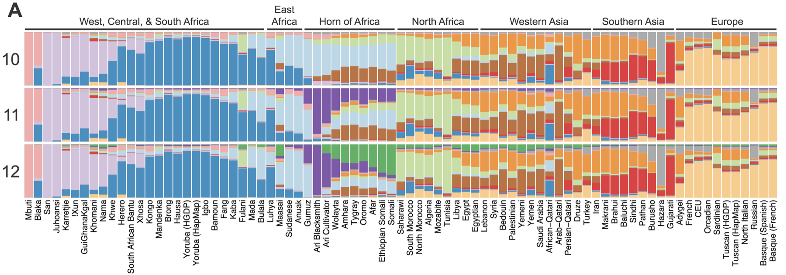
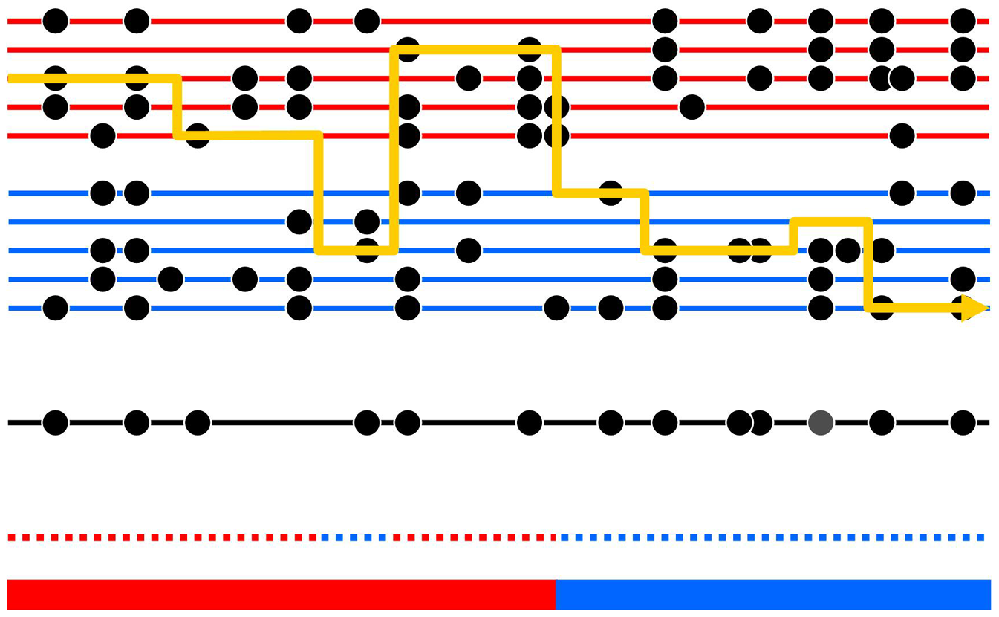

# Application to Statistical Genetics

The goals of epidemiology explicitly revolve around studying the incidence, distribution, and control of disease. As one can imagine, the boundaries of the field are highly nebulous. So far, we've looked at Hidden Markov Models as mathematical objects, devoid of any real context— aside from a toy frog example. This section intends to tie together the mathematical principals of HMMs with their connections to big areas in biostatistical & epidemiological research. We find that, yes, HMMs *are* cool because they can help save lives, bridge the gaps across survival disparities, and study our bodies.

\

---

## Local Ancestry Inference

Local Ancestry Inference (LAI) is an approach in statistical genetics & bioinformatics that aims to study genetic diversity, disease prevalence, or evolutionary development by linking each segment of a genome to some ancestral population^[http://cs229.stanford.edu/proj2015/290_report.pdf]. LAI can been used to study crop plant analysis^[https://www.ncbi.nlm.nih.gov/pmc/articles/PMC7003078/], Tilapia breeding^[https://www.nature.com/articles/s41598-020-75744-9], and the genetic adaptations of cows in East Africa^[https://www.frontiersin.org/articles/10.3389/fgene.2014.00443/full]. However, using LAI in public health studies is a critically important step, when studying ethnically-diverse cohorts.

Diasporic movement, mass-migration, colonial empire, and slavery have profoundly changed the genetic landscape of the human population. Prior to these *admixture events*, human communities were largely isolated from each other and overtime, these isolated communities genetically diverged into human sub-populations. The differences between sub-populations are largely minuscule. And while the differences are mostly nonexistent, generations of independent breeding did allow for the development of genes & mutations which are more common in some sub-populations rather than others^[https://pubmed.ncbi.nlm.nih.gov/20594047/]. 

> **NOTE:** Ancestry & Race are two different concepts that do not measure the same thing in the same way.

Admixed populations are products of the intense migratory & diasporic events which marked the 14th-19th centuries, which resulted in populations whose genetic ancestries were from 2 or more human sub-populations. We call these ancestrally-mixed populations **admixed** populations. Notable examples of admixed populations include African Americans, Latines, Ashkenazi Jews, and SWANA peoples. However, admixture is everpresent across most global populations. For example, this plot made by Hodgson et al. shows the admixture proportion across 81 different African populations with colorings for 10, 11, and 12 respective common ancestries ^[http://journals.plos.org/plosgenetics/article?id=10.1371/journal.pgen.1004393].

\

\

Unfortunately, the violence of diaspora, colonialism, and enslavement also brought the dangers of inheriting potentially dangerous mutations by family, ancestry, or ethnicity. For example, the inheritance of Tay-Sachs, Ellis-van Creveld Syndrome, diabetes, prostate cancer all occur with strong associations to ancestry^[https://pubmed.ncbi.nlm.nih.gov/20594047/]. 

So, when studying disease with evidence of some ancestral association, LAI allows public researchers to first map the ancestry of an individual's genome, before going on to find associations between disease & ancestral lineage. 

### Local Ancestry {-}

Local Ancestry is formally defined as "the genetic ancestry of an individual at a particular chromosomal location, where an individual can have 0, 1 or 2 copies of an allele derived from each ancestral population.^[https://onlinelibrary.wiley.com/doi/abs/10.1002/gepi.21819]" 

Due to the structure of gene inheritance, we can model local ancestry as a Hidden Markov Model, with the observed! This idea has been formalized throughout literature on statistical genetics, but we will look at one particular approach of using HMMs in the software HAPMIX to infer local ancestry in admixed populations.

### HAPMIX {-}

> **NOTE:** Most content in this section originates from HAPMIX's official release paper by Price et al^[https://journals.plos.org/plosgenetics/article?id=10.1371/journal.pgen.1000519].

**Definitions**

- A haplotype is a gene that is solely inherited from one parent and thus one parental population. Haplotypes are generally considered good markers of ancestral lineage.

**Assumptions:**

- We assume that the admixed population comes from only two ancestral populations
- We have access to reference data derived from unadmixed reference populations
- The unadmixed reference populations are closely related to the true ancestral populations.

**Process**

1) At every locus, HAPMIX estimates the likelihood that a "parental" haplotype from an admixed individual comes from a referenced ancestral population.

2) Loci that are next to each other are more likely to come from the same ancestral lineage^[due to a concept called Linkage Disequilibrium], but that doesn't hold true after enough positions. So, we say that the number of genes inherited from an ancestral population at the $j^th$ locus, can be strictly predicted by the ancestry of the ${j-1}^{th}$ locus.

3) We can then use a HMM where the hidden states are the number of ancestral genes inherited $(0,1,2)$ at locus $j$ and the observations are the likelihoods of observing some mutation at locus $j$, given the ancestral reference panel.

4) Using a smoother analysis, similar to the Forward-Backward Algorithm, we can combine these likelihoods into to provide a probabilistic estimate of ancestry at each locus. 

**Visual**

Below is a visual made by Price et al. describing the HMM employed in HAPMIX.

- The thick bottom bar represents the true 2-state ancestral composition of an individual, the dotted line above it represents the ancestral reference panel, from which we compute likelihoods.
- The line line represents a chromosomal segment of an individual, while the black circles represent typed mutations sites that can be distinguished between the ancestries.
- When the yellow line crosses a red or blue line, it is visualizing the selection of an ancestral group, given the individual's observed chromosome. Notice that when the line crosses through a dot on one particular side, it will choose the side with equal or greater dots that are vertically aligned.
- The yellow line can misclassify the ancestries, since this is a probabilistic model. Notice the portion of blue dots above the red bar.

### Conclusion

LAI is only one application of HMMs. Variations of HMMs can be used to study the differential use of condoms for HIV prevention^[https://www.ncbi.nlm.nih.gov/pmc/articles/PMC3649016/], the race-differences in the progression of HIV for vulnerable, infected, and AIDS positive people between African American & White People^[https://www.ncbi.nlm.nih.gov/pmc/articles/PMC4023279/], or even when automatically monitoring the development of Influenza outbreaks^[https://link.springer.com/chapter/10.1007/978-3-540-45231-7_48]. 

This is only a primer (with a de-emphasis on application), but I absolutely suggest reading through the footnote references to so how cool HMMs become when using them to find ways of helping people, treating illness, and more!

\

## References {-}
 
 
 
 
 
 